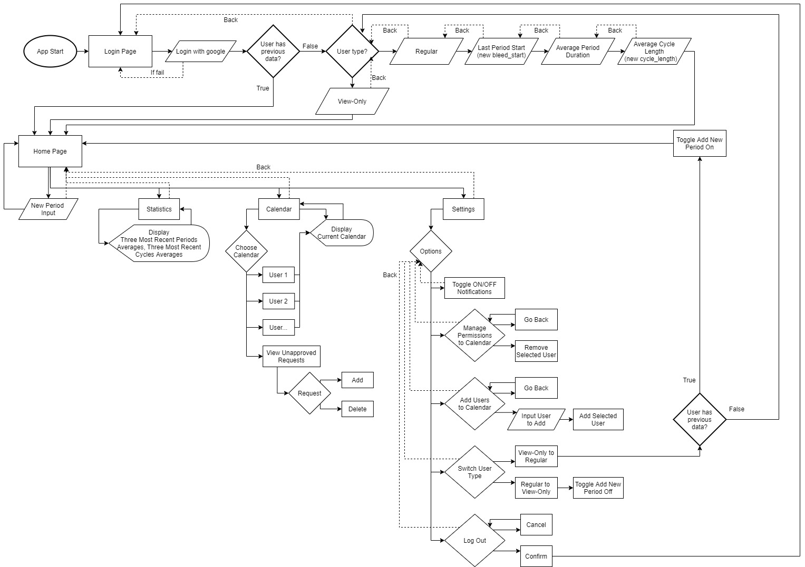

# flovver-app Folder Rundown

## This folder contains most if not all of the components used for the frontend of the application, as well as the basic .json files and configurations.

* App.tsx -  File containing the existing routes that the applications uses.

```
<Route exact path="/Login" component={Login} />

<Route path="/InitialForm" component={InitialForm} />

<Route path="/Home" component={Home} />

<Route path="/" render={()=><Redirect to="/Home/Index"/>} />         
```

* /assets - Contains basic components of the application such as font style and the app icons.
* /backend_requests
* /components - All the visual components of the application
    * /calendar - Holds the components that make up the calendar section in the application.
        * Avaliable Routes: Home
    * /home - Holds the components that make up the main area of the application.
    * /initial_forms - Holds the components that make up the initial form provided for new users.
    * /login - Holds the components that make up the initial google login screen.
    * /settings - Holds the components that make up the settings area inside the application.
    * /shared - Holds the implemented hooks and shared methods for other classes to use.
    * /statistics - Holds the components that make up the statistics section inside the application.
* /images - Contains all the used icons to be displayed in the application.
* /store - Contains all the global state configurations.
    * /actions
    * /interfaces
    * /reducers
* /styles - Contains the color pallet used in the application.

# Frontend State Diagram

